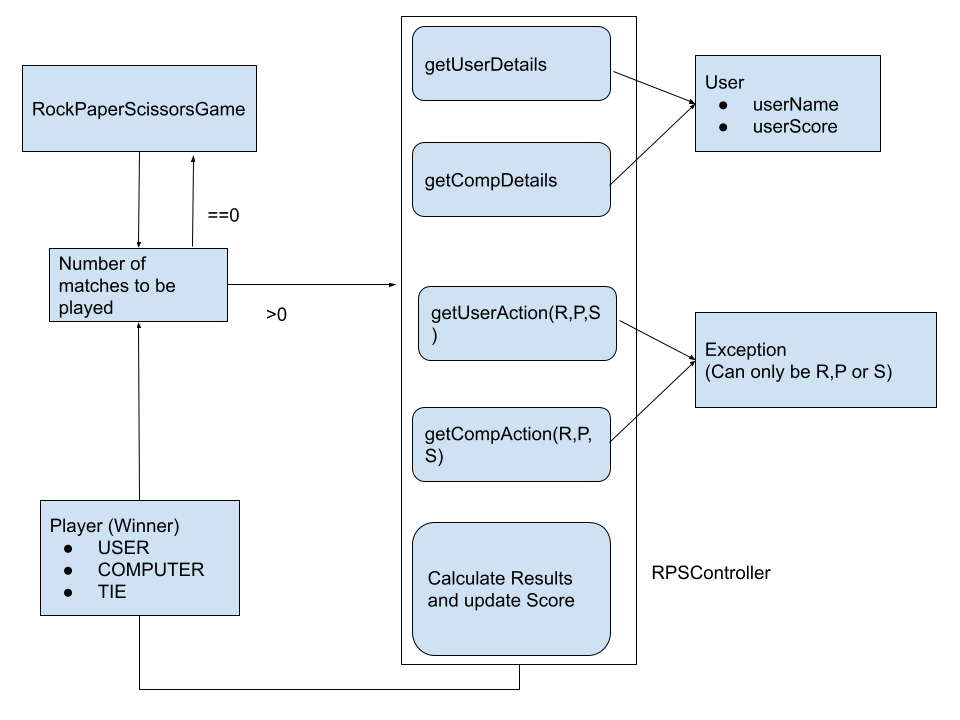

# rock-paper-scissor
Rock Paper Scissors Game in Java

This is a minimalistic java application that allows user to play the game of "Rock-Paper-Scissors."

The code is developed with an object oriented approach, where the different files are placed in their respective directories for easy scaling and enhancement purposes in the future.

The general rules for the game are:

• Paper beats (wraps) rock

• Rock beats (blunts) scissors

• Scissors beats (cuts) paper.

Below is a simple rough design for the game.

**To run the application:**

Simply import the application and run the main method from the RockPaperScissorsGame.java class.
If it does not work, simply compile and install required artifacts using "mvn clean install".

The code is unit-tested using Java Junit framework, which is the only external imported plugin used in the project.
Code coverage is 100% for all classes.

The classes are developed in such a way that if requirements change down the line, they can be easily incorporated. 
For example:

1. If requirements are against randomization of the computer action, it can be easily changed in the RandomActionService class to whatever is needed.
2. If the players need to be increased, we can easily manipulate the enum in the Player Entity.
3. If more validations need to be added, RPSController will be changed.
4. There is a separate exceptions directory for Custom Exceptions that can be thrown.
